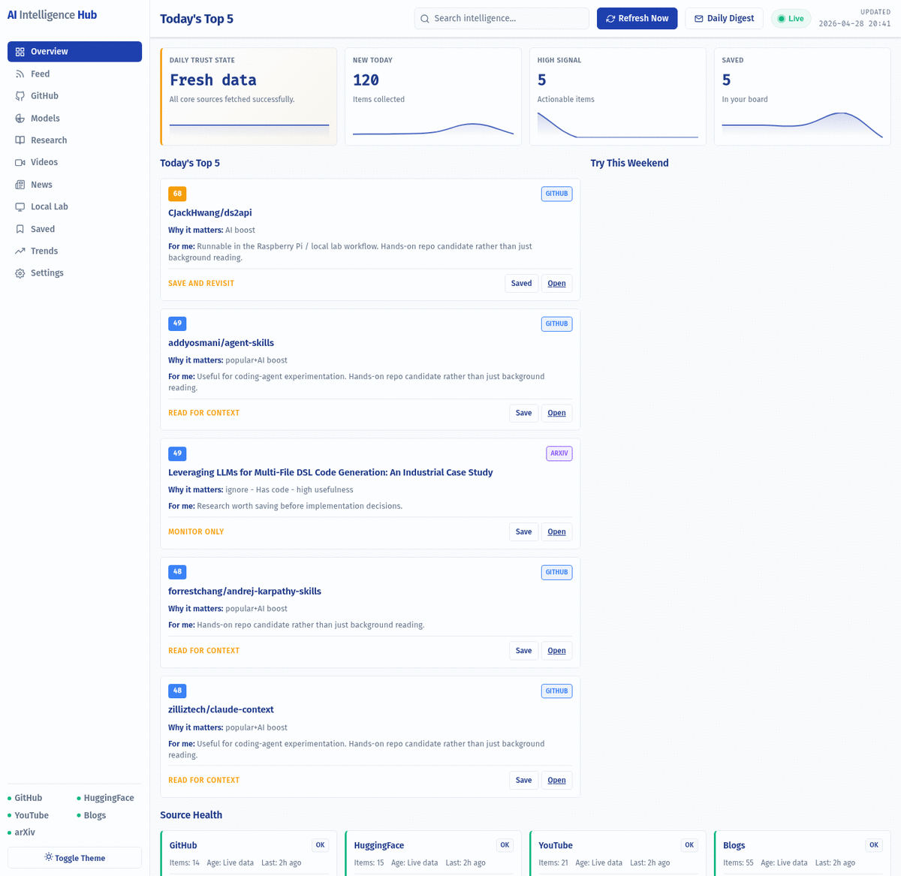
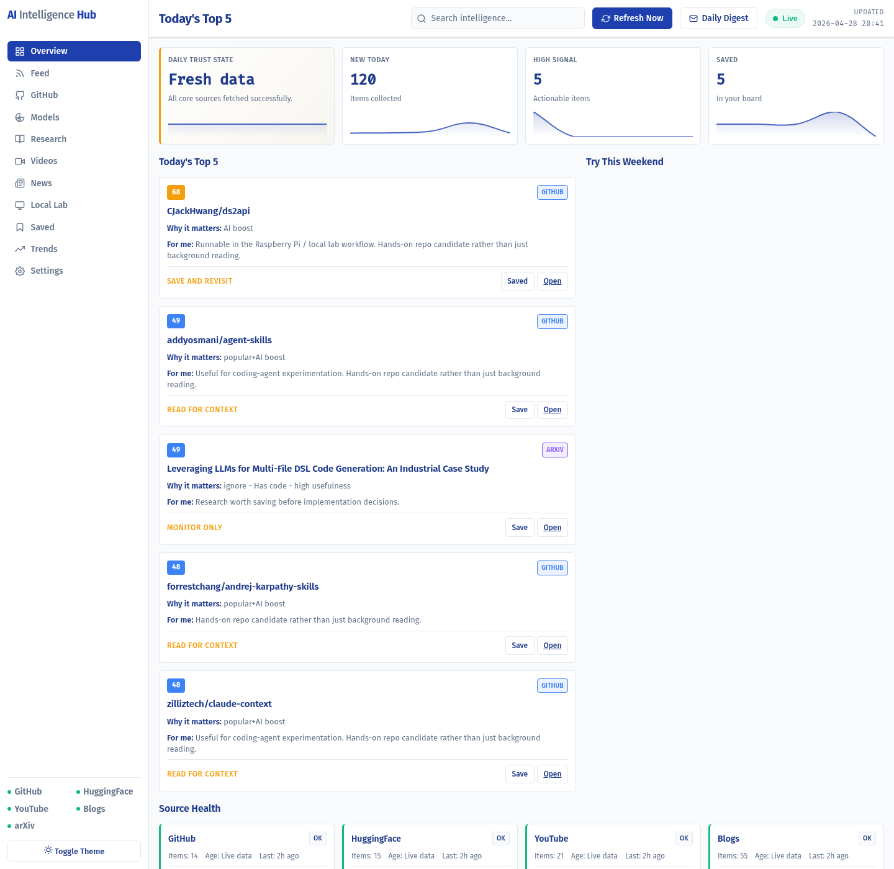
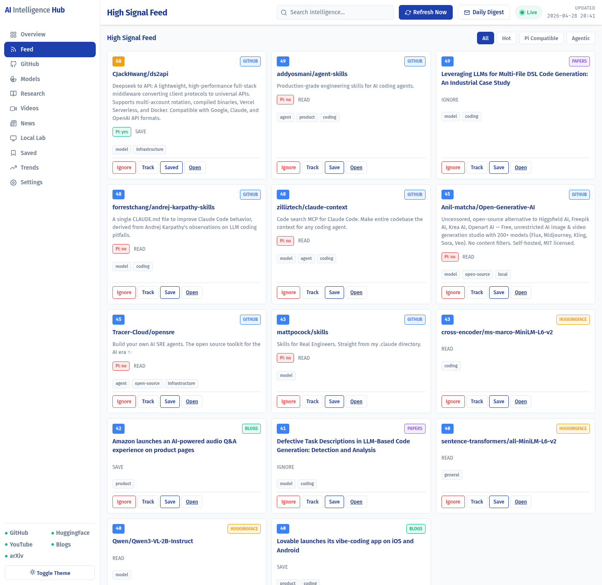
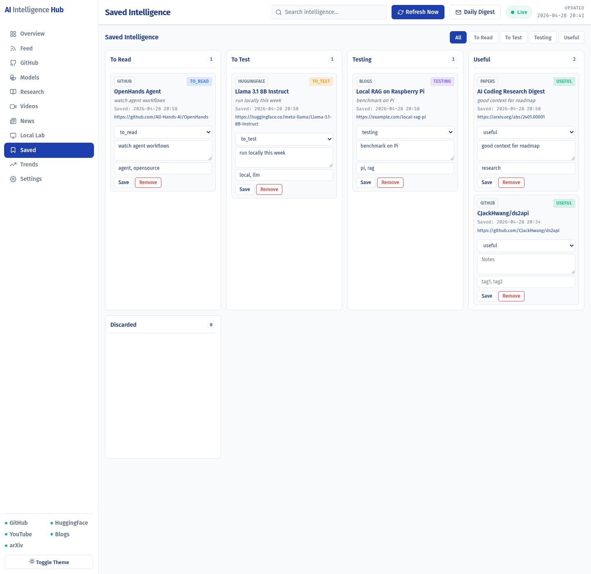
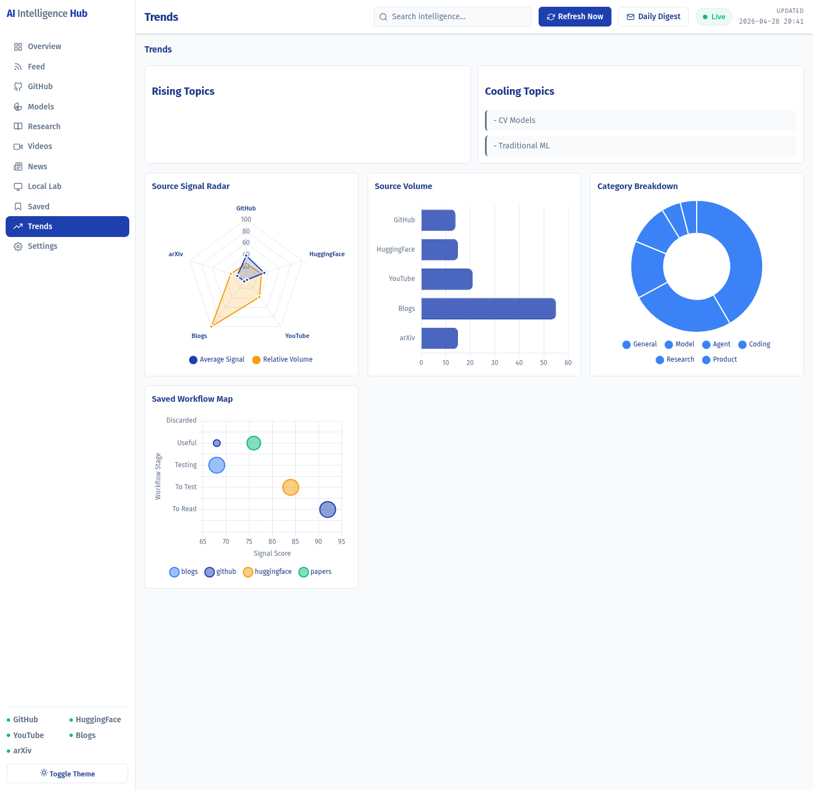
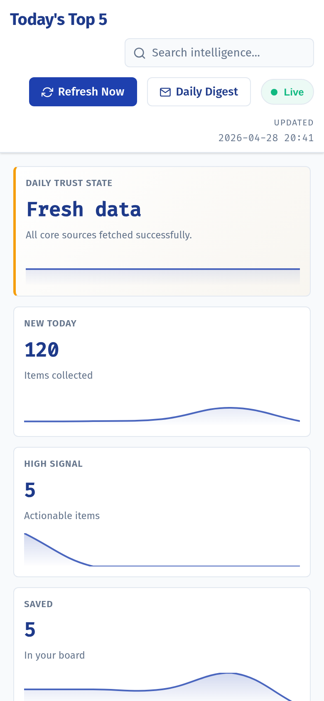
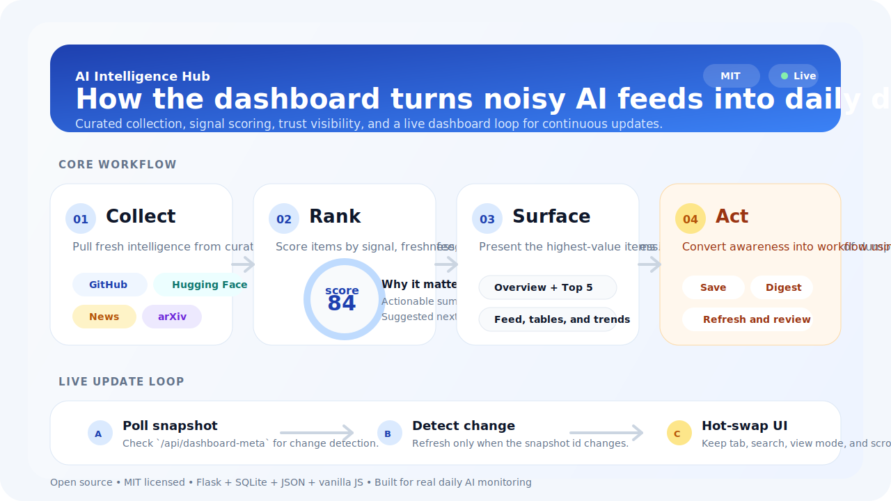

# AI Intelligence Hub


AI Intelligence Hub is a lightweight open-source dashboard for tracking the AI ecosystem across GitHub, Hugging Face, research, video, and news sources.

It is built for people who want a daily AI signal cockpit instead of a generic RSS reader.

## Why It Exists

Most AI feeds are noisy.

AI Intelligence Hub focuses on:

- high-signal items instead of raw volume
- source freshness and trust visibility
- local workflow relevance for builders
- a saved board that turns reading into action

## Highlights

- **Modern dashboard UI** with sidebar navigation and a clean overview page
- **Live dashboard updates** that refresh the UI when server data changes
- **Manual refresh pipeline** for immediate external fetches
- **Top 5 signal briefing** for fast daily triage
- **Saved intelligence board** with workflow states like `to_read`, `to_test`, and `useful`
- **Source health model** with OK / cache / stale / failed states
- **Card and table views** for dense sections
- **Daily digest generation** in Markdown
- **Flask + SQLite + JSON + vanilla JS** with no heavy frontend framework

## Screenshots

### Walkthrough



### Product Views

#### Overview



#### Feed



#### Saved Workflow Board



#### Trends



#### Mobile Overview



### How It Works



## Data Sources

Current source families:

- GitHub trending repositories
- Hugging Face model activity
- arXiv AI papers
- curated YouTube channels
- curated AI blogs and news feeds

Included blog/news feeds currently include:

- OpenAI
- Google AI
- TechCrunch AI
- The Verge AI
- MIT Technology Review
- Hugging Face Blog
- NVIDIA Developer Blog
- AWS Machine Learning Blog
- Microsoft Research AI
- MarkTechPost
- Berkeley BAIR

## Live Update Model

The dashboard has two update paths:

### Automatic live updates

- the UI polls a lightweight snapshot endpoint
- if server-side data changed, the dashboard refreshes its rendered content
- the active tab, search query, view mode, and scroll position are preserved

### Refresh Now

- calls `POST /api/refresh`
- fetches external sources immediately
- rescoring runs on the fresh data
- source health is updated
- the UI reloads from the refreshed dataset

In short:

- **live updates** reflect changed server state
- **Refresh Now** fetches new external data immediately

## Quick Start

### Docker

```bash
docker build -t ai-dashboard .

docker run -d --name ai-dashboard \
  -p 8888:8888 \
  -v $(pwd)/data:/app/data \
  -e DATA_DIR=/app/data \
  -e DB_PATH=/app/data/intelligence.db \
  -e CACHE_DIR=/app/data/cache \
  -e DIGEST_DIR=/app/data/digests \
  -e DATA_FILE=/app/data/data.json \
  -e SCORED_DATA_FILE=/app/data/data_scored.json \
  --restart unless-stopped \
  ai-dashboard
```

Open `http://localhost:8888`.

### Local Python

```bash
python3 -m venv .venv
source .venv/bin/activate
pip install -r requirements.txt
python3 dashboard_new.py
```

## Core Workflows

### Daily check-in

1. Open **Overview**
2. Read the trust state and source health
3. Review **Today's Top 5**
4. Save anything worth revisiting

### Saved intelligence workflow

1. Save items from Feed, GitHub, Models, or Research
2. Move them into `to_test`
3. Add notes and tags
4. Promote useful items or discard stale ones

### Digest workflow

1. Open **Daily Digest**
2. Generate the latest Markdown summary
3. Copy or save the digest for sharing

## Architecture

```text
AI-Intelligence-Hub/
├── dashboard_new.py          # Flask app and routes
├── fetch_news.py             # external source fetch pipeline
├── scoring_engine.py         # scoring and ranking logic
├── data_models.py            # SQLite state and source health
├── digest_generator.py       # Markdown digest generation
├── templates/dashboard.html  # main server-rendered UI
├── static/app.css            # design system and layout
├── static/app.js             # live updates and interactions
├── config.json               # runtime source configuration
└── data/                     # runtime cache, digests, and DB
```

## API Surface

- `GET /` - dashboard UI
- `GET /health` - container health check
- `GET /api/data` - raw source data
- `GET /api/scored` - scored data payload
- `GET /api/dashboard-meta` - lightweight live-update snapshot
- `GET /api/source-health` - normalized source health summary
- `POST /api/refresh` - trigger external fetch and refresh
- `POST /api/save` - save an item
- `GET /api/saved` - list saved items
- `PUT /api/saved/<id>/status` - update saved status
- `PUT /api/saved/<id>/notes` - update notes and tags
- `DELETE /api/saved/<id>` - remove saved item
- `POST /api/ignore` - hide an item
- `GET /api/ignored` - list ignored items
- `POST /api/track` - track a topic
- `GET /api/track` - list tracked topics
- `DELETE /api/track/<id>` - remove tracked topic
- `GET /api/digest` - build today’s Markdown digest

## Development

### Run tests

```bash
python3 -m pytest -q
```

### Validate key files

```bash
python3 -m py_compile dashboard_new.py data_models.py fetch_news.py
node --check static/app.js
```

### Manual fetch

```bash
python3 fetch_news.py
```

## Repository Docs

- `CONTRIBUTING.md`
- `SECURITY.md`
- `CHANGELOG.md`
- `docs/ui_review_checklist.md`
- `docs/screenshots/README.md`

## Roadmap

- better source configuration via UI
- smarter deduplication and clustering
- richer saved-item workflow operations
- deeper trend analytics with accessible chart fallbacks
- more source families and better source filtering

## Project Status

Current status:

`v0.6.0 UI Redesign Release Candidate`

This repo is actively evolving. Expect rapid iteration on data quality, workflow UX, and presentation.

## Contributing and Feedback

Issues and pull requests are welcome.

If you are using the dashboard for research, engineering leadership, or internal AI scouting, open a feature request and describe the workflow you want to support.

## License

MIT. See `LICENSE`.
